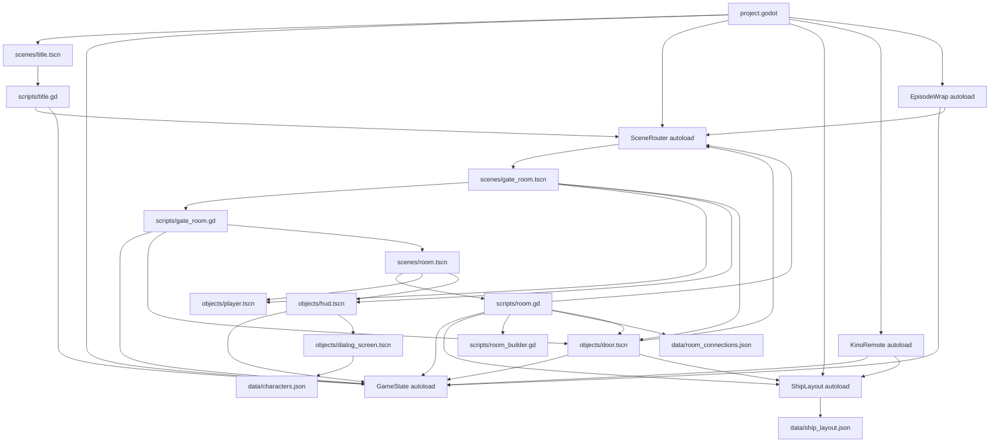
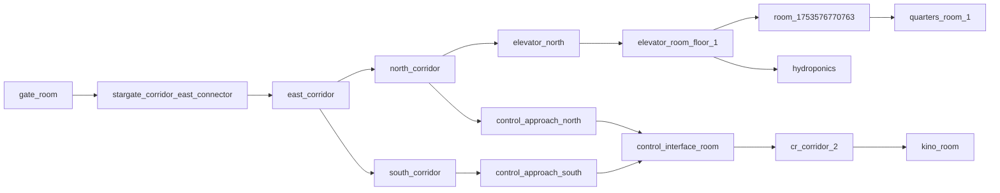
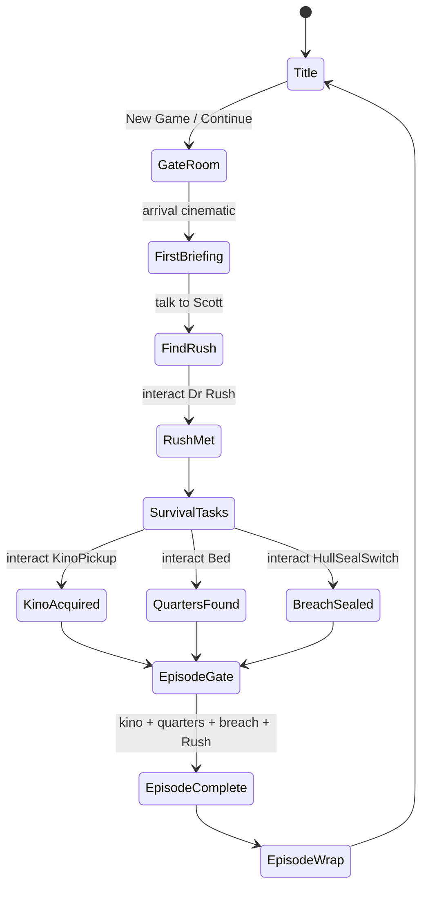

# Codebase Dependency Graph

Last indexed: 2026-05-24

This document indexes the current Godot-era codebase from `project.godot`, scene resources, GDScript resource references, autoload usage, data files, and smoke-test evidence.

## Index Summary

| Area | Count | Notes |
|---|---:|---|
| Indexed text/resources | 181 | Excludes `.git`, `.godot`, `.agents`, `.claude`, binary media, and imported cache output. |
| Static dependency edges | 263 | Resource refs, autoload refs, signal connections, and scene transitions. |
| Autoload services | 8 | `Audio`, `TestCapture`, `GameState`, `SceneRouter`, `KinoRemote`, `EpisodeWrap`, `Settings`, `ShipLayout`. |
| GDScript files | 34 | 6,520 total lines across runtime scripts, object scripts, and tests. |
| Scene files | 18 | 4 main scenes, 13 object scenes, 1 playthrough test scene. |
| Ship layout rooms | 19 | Data-driven procedural room generation through `scenes/room.tscn`. |
| Room connection sources | 12 | Directed authored edges in `data/room_connections.json`. |
| Character registry entries | 10 | Plus `_comment`, consumed by dialog UI. |

## Runtime Graph



## Central Services

| Service | File | Primary Dependents | Responsibility |
|---|---|---|---|
| `GameState` | `scripts/game_state.gd` | HUD, title, doors, NPCs, room scripts, tests | Persistent E1 story state, objectives, health/oxygen, save/load, logs, dialog events, episode completion. |
| `SceneRouter` | `scripts/scene_router.gd` | title, doors, episode wrap, playthrough runner | Fade transition, scene switching, spawn placement, player orientation after door transitions. |
| `ShipLayout` | `scripts/ship_layout.gd` | room generation, door plaques, Kino map, scene smoke tests | Loads `data/ship_layout.json`, exposes room lookup and scaled room dimensions. |
| `KinoRemote` | `scripts/kino_remote.gd` | input system, GameState, ShipLayout | Global pause overlay with map, status, objectives, and inventory after Kino acquisition. |
| `EpisodeWrap` | `scripts/episode_wrap.gd` | GameState episode completion | Displays mission wrap card and routes back to title. |
| `Settings` | `scripts/settings.gd` | title screen | Audio bus volume and difficulty config persisted to `user://settings.cfg`. |
| `Audio` | `scripts/audio.gd` | player, object interactions, tests | One-shot sound playback helper. |
| `TestCapture` | `scripts/test_capture.gd` | smoke/capture workflows | Deterministic screenshot helper for visual proof. |

## Scene Ownership

| Scene | Root | Script | Role |
|---|---|---|---|
| `scenes/title.tscn` | `Title: Control` | `scripts/title.gd` | Main menu, settings overlay, continue/new game entry into gate room. |
| `scenes/gate_room.tscn` | `GateRoom: Node3D` | `scripts/gate_room.gd` | Hand-built arrival room with Stargate, Scott/Rush setup path, consoles, exit door, ambient state. |
| `scenes/room.tscn` | `Room: Node3D` | `scripts/room.gd` | Data-driven procedural room shell that resolves `GameState.next_room_id` and spawns doors, mission interactables, and NPCs. |
| `scenes/main.tscn` | `Main: Node3D` | `scripts/main.gd` | Kenney starter-kit scene; useful as legacy/demo reference, not current E1 route. |
| `tests/playthrough/playthrough.tscn` | `PlaythroughBootstrap: Node` | `tests/playthrough/bootstrap.gd` | Boots `scripts/playthrough_runner.gd` as a persistent root-level integration driver. |

## Object Prefabs

| Prefab | Runtime Script | Dependencies |
|---|---|---|
| `objects/player.tscn` | `scripts/player.gd` | `objects/character.tscn`, `models/colormap.tres`, `sounds/walking.ogg`, `sounds/jump.ogg`, `Audio`. |
| `objects/hud.tscn` | `scripts/hud.gd` | `GameState`, `objects/dialog_screen.tscn`, dialog UI sprites. |
| `objects/dialog_screen.tscn` | `scripts/dialog_screen.gd` | `data/characters.json`, portrait sprites. |
| `objects/door.tscn` | `scripts/door.gd` | `GameState`, `SceneRouter`, `ShipLayout`, `scenes/room.tscn`, `scenes/gate_room.tscn`. |
| `objects/stargate.tscn` | `objects/stargate.gd` | Procedural gate mesh/light generation. |
| `objects/brick.tscn` | `objects/brick.gd` | Starter-kit breakable block, `Audio`, mesh/material resources. |
| `objects/coin.tscn` | `objects/coin.gd` | Starter-kit collectible, `Audio`, particle sprite. |
| `objects/platform_falling.tscn` | `objects/platform_falling.gd` | Starter-kit falling platform, `Audio`. |

## Procedural Room Data Graph



Key authored gameplay destinations:

| Destination | How Reached | Current Purpose |
|---|---|---|
| `control_interface_room` | Gate room route through east/north/control approach | Dr Rush NPC and Rush story gate. |
| `kino_room` | `control_interface_room` -> `cr_corridor_2` -> `kino_room` | Kino pickup. |
| `quarters_room_1` | `east_corridor` -> `north_corridor` -> `elevator_north` -> upper deck corridor | Bed interaction sets `quarters_found`. |
| `east_corridor` | First data-driven room after gate connector route | Hull breach and seal switch. |
| `hydroponics` | Upper deck elevator branch | Present in map/route data, not part of E1 completion. |

## Gameplay State Graph



The current completion gate in `GameState.check_episode_complete()` requires:

- `kino_acquired == true`
- `met_rush == true`
- `quarters_found == true`
- `breaches_sealed.size() > 0`

## Test Graph

| Test | File | Coverage | Latest Result |
|---|---|---|---|
| Scene boot | `tests/smoke/scene_boot.gd` | Title, gate room, every procedural room row, mission interactables, connection reachability to key destinations. | PASS |
| E1 flow | `tests/smoke/e1_flow.gd` | Autoload registry, `GameState` mutators, E1 completion gate, save/write/wipe payload. | PASS |
| E1 playthrough | `scripts/playthrough_runner.gd` | Real `SceneRouter` + door transition from gate room to `stargate_corridor_east_connector` and back, FTL/gate console interactions. | PASS |

Verification command:

```bash
tests/run.sh
```

The first sandboxed run failed before game code executed because Godot could not write `user://logs`. Running the same command outside the sandbox passed all three tests.

## Current Hotspots

| File | Reason |
|---|---|
| `scripts/gate_room.gd` | Large hand-authored scene builder for the arrival room, NPCs, consoles, stairs, Stargate, and environment geometry. |
| `scripts/room.gd` | Central data-driven room runtime: layout resolution, door stamping, mission interactables, hull breach geometry, NPC spawning, connection loading. |
| `scripts/door.gd` | Owns both door visuals and routing behavior; depends on `GameState`, `SceneRouter`, and `ShipLayout`. |
| `scripts/game_state.gd` | Single source of truth for progression, save/load, objective state, and signals. |
| `scripts/playthrough_runner.gd` | Integration proof currently covers only the first route segment, not full E1 completion. |

## Next Indexing Gaps

- Convert this static index into a small generator once the graph format stabilizes.
- Add reverse-dependency output for high-risk files before large refactors.
- Add asset existence validation for portrait paths and generated GLB paths.
- Add scene-to-data coverage checks for all authored `room_connections.json` destinations.
