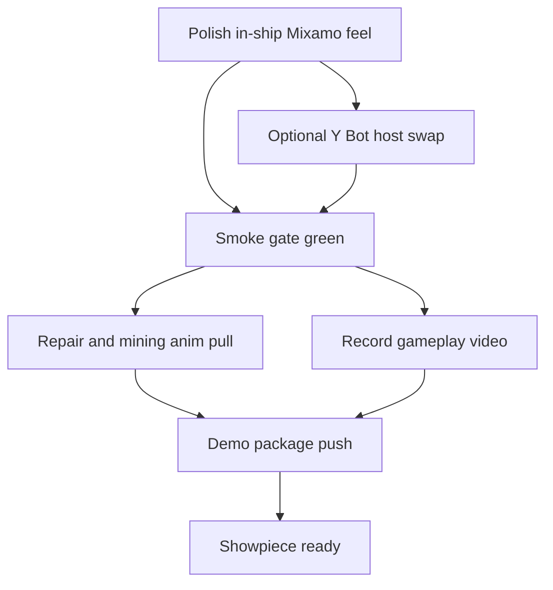

# Engineering Graph Loop — Mixamo Demo Showpiece

**Branch:** `feature/mint-character-proof-of-concept`  
**Goal:** Cool Destiny ship-scene demo with Mixamo combat + recorded gameplay video.

Opened via Cursor Automations template `engineering-graph-loop` (Glass UI).  
Supermemory notes saved under gaming / mixamo / newscore scope.

## Done already

- [x] Signed-off Mixamo combat showcase + docs
- [x] `MixamoCombatAvatar` wired into `player.gd` (RMB aim / LMB fire / OTS camera)
- [x] Y Bot, X Bot, Exo Gray, Exo Red downloaded to `models/mixamo_openbot/incoming/` (gitignored)
- [x] Smoke: mixamo-player, e1-opening, scene

## Graph nodes (execute in order; parallel where noted)



### Node A — In-ship combat polish
- Launch `gate_room` / `room` with local Swat pack
- Tune capsule / foot plant / camera OTS if needed vs showcase
- Ensure dialog/Kino still releases mouse correctly

### Node B — Y Bot host (optional parallel)
- Blender pack: retarget combat clips onto Y Bot (same Mixamo skeleton)
- Keep Swat as fallback; prefer Y Bot as “Eli temp” if Swat reads too SWAT

### Node C — Smoke gate
```bash
tests/run.sh mixamo-player
tests/run.sh e1-opening
tests/run.sh scene
tests/run.sh mint-character
```

### Node D — Repair / mining backlog assets
- Export Digging + Working On Device onto Y Bot when Mixamo rate limit clears
- IDs: Digging `c9c6cd3e-b96c-11e4-a802-0aaa78deedf9`, Working On Device `c9c6cf65-b96c-11e4-a802-0aaa78deedf9`
- Stub interact pose OK for demo; full tool loops can follow

### Node E — Gameplay video
- Headed Godot capture (Movie Maker or ffmpeg of window)
- Script: walk corridor → aim → fire → holster → interact beat
- Output: `screenshots/result/mixamo_combat_demo.mp4` (or similar; do not commit huge binaries unless asked)

### Node F — Push
- Conventional commits only for code/docs
- Never commit Mixamo FBX/GLB under ToS gitignore

## Stop condition

Ship-scene Mixamo aim/fire feels showcase-grade **and** a gameplay video exists **and** smoke gates above are green **and** branch is pushed.
