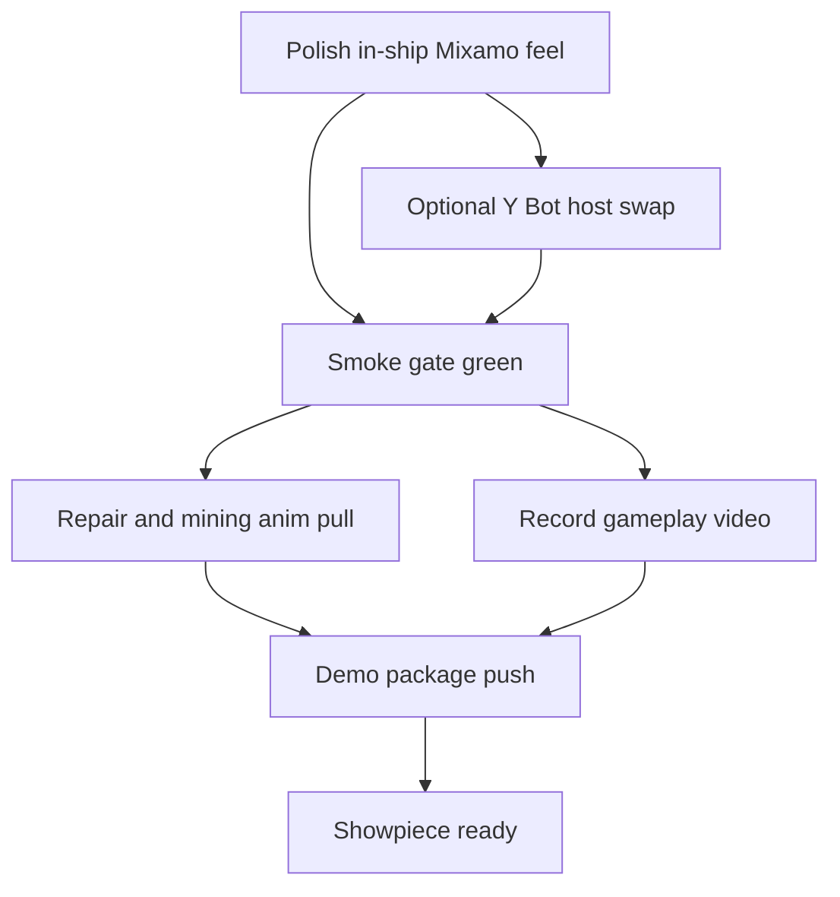

# Engineering Graph Loop — Mixamo Demo Showpiece

**Branch:** `feature/mint-character-proof-of-concept`  
**Goal:** Cool Destiny ship-scene demo with Mixamo combat + recorded gameplay video.

Opened via Cursor Automations template `engineering-graph-loop` (Glass UI).  
Supermemory notes saved under gaming / mixamo / newscore scope.

## Done already

- [x] Signed-off Mixamo combat showcase + docs
- [x] `MixamoCombatAvatar` wired into `player.gd` (RMB aim / LMB fire / OTS camera)
- [x] Y Bot, X Bot, Exo Gray, Exo Red downloaded to `models/mixamo_openbot/incoming/` (gitignored)
- [x] Smoke: mixamo-player, e1-opening, scene

## Graph nodes (execute in order; parallel where noted)



### Node A — In-ship combat polish
- [x] Launch `gate_room` / `room` with local Swat pack (player default `use_mixamo_avatar`)
- [x] Capsule radius 0.28 + floor-centered plant; foot align deferred once
- [x] Camera: combat hip/aim zoom (~3.2 / ~2.55) + OTS shoulder 0.55 (showcase-scale, not ship spring 7 m)
- [x] Dialog clears aim + releases mouse; `dialog_closed` / `kino_closed` re-captures when `combat_look`
- [x] Smoke: `mixamo_player_bridge` covers isolated player + `gate_room` boot (skips if pack missing)

### Node B — Y Bot host (optional parallel)
- [x] Partial — cloud fallback uses Mixamo-rigged **proxy mannequin** (Y-Bot-like) via
  `tools/blender_mixamo_proxy_combat.py` when Swat FBX is absent
- Full Y Bot skin retarget still deferred until `incoming/Y Bot.fbx` is present
- Keep real Swat builder as preferred path when ToS-local FBXs exist

### Node C — Smoke gate
- [x] Green (2026-07-24): `mixamo-player`, `e1-opening`, `scene`, `mint-character`
```bash
tests/run.sh mixamo-player
tests/run.sh e1-opening
tests/run.sh scene
tests/run.sh mint-character
```
- [x] Hardened `_finish_mixamo_spawn` so scene-boot frees no longer resume into a dead tree
- [x] Cloud rebuild path: `blender -b -P tools/blender_mixamo_proxy_combat.py` → local `Swat_rifle_combat.glb`

### Node D — Repair / mining backlog assets
- [x] Stub interact clip packed as `Interact_Stub` (from `pointingwitharmbent.fbx`) in proxy pack
- [ ] Full Digging / Working On Device Mixamo pulls still need Adobe download into `incoming/`
- IDs: Digging `c9c6cd3e-b96c-11e4-a802-0aaa78deedf9`, Working On Device `c9c6cf65-b96c-11e4-a802-0aaa78deedf9`

### Node E — Gameplay video
- [x] Headed Movie Maker capture of gate_room Mixamo loco + RMB aim + LMB fire
- Script: `tests/shots/mixamo_combat_demo_movie.gd` (walk → aim → strafe → fire → holster → jog)
- Wrapper: `tools/record_mixamo_combat_demo.sh` (Linux `vulkan` / macOS `metal`)
- Player demo drive: `set_demo_combat(aiming, firing)` / `clear_demo_combat()` on `player.gd`
- **Output (gitignored under `screenshots/`):**
  - Video: `screenshots/result/mixamo_combat_demo.mp4` (1280×720 @ 30fps)
  - Beat frames: `screenshots/result/mixamo_combat_demo/01_holster_idle.png` … `07_end.png`
  - Raw AVI (local): `screenshots/result/mixamo_combat_demo_raw.avi`
- **Replay / re-record:**
```bash
# if pack missing:
blender -b -P tools/blender_mixamo_proxy_combat.py
tools/record_mixamo_combat_demo.sh
# open: screenshots/result/mixamo_combat_demo.mp4
```

### Node F — Push
- [x] Conventional commits for code/docs only
- Never commit Mixamo FBX/GLB under ToS gitignore
- Never commit `models/mint/rush` or huge `screenshots/` binaries

## Stop condition

Ship-scene Mixamo aim/fire feels showcase-grade **and** a gameplay video exists **and** smoke gates above are green **and** branch is pushed.
