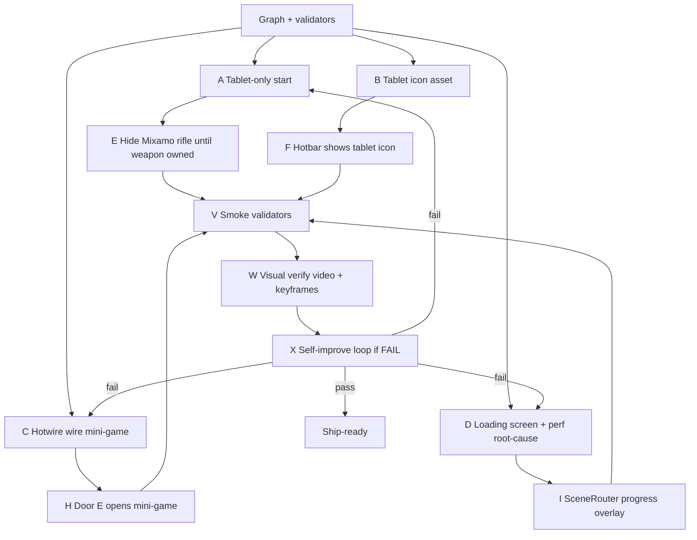

# Engineering Graph — Weapons/Tools Playtest Fixes

**Branch:** `feature/weapons-tools`  
**Date:** 2026-07-27  
**Goal:** Tablet-only start, real wield visuals, hotwire mini-game, loading screen, ship feel.

## Nodes

| ID | Work | Parallel? | Validator |
|----|------|-----------|-----------|
| A | Starter = tablet only (no sidearm) | yes w/ B,C,D | `door_hotwire` + inventory smoke |
| B | Tablet PNG (iPad-like), not kino remote | yes | icon path exists + HUD shows it |
| C | Tablet wire-connect mini-game UI | yes | smoke: soft-lock clears after puzzle |
| D | Loading overlay + why transitions slow | yes | timed SceneRouter transition log |
| E | Holster/hide rifle until weapon in inventory | after A | Mixamo no rifle mesh at New Game |
| F | Wire icon into items.json hotbar | after B | visual keyframe |
| H | Door/panel opens mini-game | after C | playtest E on door |
| I | Hook SceneRouter.change_to progress | after D | no blank hang >0.5s without UI |
| V | Smokes + lint subset | after A–I | `tests/run.sh door-hotwire inventory` |
| W | Movie Maker / capture keyframes + mp4 | after V | `screenshots/result/weapons_tools_verify/` |
| X | If W fails, loop failed nodes | conditional | re-run W |

## Status
- A/B/F: tablet-only seed + `sprites/ui/items/tablet.png` — DONE
- C/H: `HotwireMinigame` wire-connect + door/panel await play — DONE
- D/I: SceneRouter loading overlay + threaded load + Mixamo PackedScene cache — DONE
- E: `set_weapon_visible` + held tablet prop — DONE
- V: `door_hotwire` + `inventory` smokes updated — DONE
- W: `tools/record_weapons_tools_verify.sh` — run for video + keyframes
